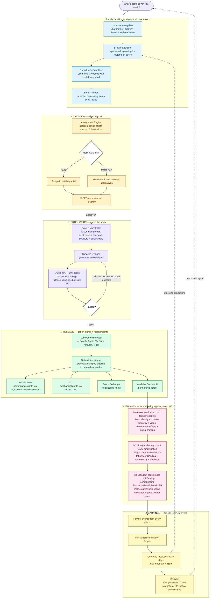

# SoundPulse — Streamlined Product Spec

> Plain-language read of the SoundPulse system. Skip this if you want SQL,
> migration numbers, or file paths — those live in `SoundPulse_PRD_v3.md`
> and `schema.md`. This document tells you **what SoundPulse is, how it
> makes money, and what runs today.** It is a fork of the main PRD, not a
> replacement.

---

## 1. What SoundPulse is

SoundPulse is a fully autonomous record label. It signs artists, releases songs, runs marketing campaigns, and collects royalties — and the only human in the loop is the CEO, who approves a few critical decisions a week. Everything else is software.

The artists are AI-generated personas with their own voice, look, backstory, and discography. The songs are generated to match what the music data says is about to win. Distribution, performance-rights registration, social posting, and royalty collection are all handled by a fleet of 14 specialized agents.

The output of SoundPulse is not a dashboard. It's a catalog of songs that earn streaming revenue.

---

## 2. The thesis

The music industry runs on three slow loops:

1. **A&R discovers an artist** — months to years.
2. **The artist writes and records a song that fits the moment** — weeks to months, and most of them miss.
3. **The label distributes, registers rights, and markets it** — weeks of coordination across 5–10 partners.

SoundPulse compresses all three into hours. We can spot what's about to break (the streaming charts give us live data 24/7), generate a song that matches the winning pattern, distribute it to every store, register every right, and start marketing — all without waiting for a human to write or perform anything.

The economics work because each song costs roughly **a dollar** to produce end-to-end (LLM calls, generation, image work, infrastructure) and earns **$30–40 a month** at a modest 10,000 streams. Five hundred songs at that level is around $20,000/month against ~$4,000/month of running costs. The break-even sits around 200 songs in catalog at 3,000 streams each, which we expect to clear 4–6 months after the production pipeline is fully autonomous.

---

## 3. The end-to-end map

For a richer visual, open the companion file `Ceasar_PRD_streamlined_diagram.html` in any browser — it's a single self-contained page (no installs, no internet). The mermaid diagram below renders on GitHub and most modern markdown viewers as a flowchart fallback.

**The two dotted feedback arrows are why the system gets better over time:** outcomes from each song improve the prediction model that picks the next opportunity, and reinvested revenue funds the next batch of generations.

## 4. The lifecycle in detail

This is the loop the system runs continuously, expanded from the diagram above:

**1. Detect what's about to win.** A "breakout engine" watches the streaming charts and flags tracks that are growing more than twice as fast as their genre's median. It then looks at what those breakouts have in common — tempo, mood, lyrical theme, the cultural references they invoke — and surfaces "opportunity zones": specific sounds where demand is climbing but supply is thin.

**2. Quantify the opportunity.** For each opportunity zone, the system estimates the dollar revenue a new song could earn — low / median / high — and attaches a confidence score so the CEO knows how much weight to put on the number. The estimates are conservative: they discount against the actual breakout cohort by ~25% because survivor bias inflates the live numbers.

**3. Write a recipe for the song.** Each opportunity becomes a "blueprint" — a structured spec that says "around this BPM, in this key, with this energy, with these themes, with this kind of voice, in this length, for this listener." A language model assembles the blueprint from everything we know about the breakout cohort plus this week's cultural references (the system maintains a live feed of TikTok phrases, slang, viral moments, brand mentions).

**4. Decide who sings it.** Existing artists in the roster get scored against the blueprint across ten dimensions — does the genre match, does the voice fit, would this audience overlap with theirs, are they already overexposed in this lane, and so on. If an existing artist fits well enough, the song goes to them. If not, the system proposes three new artist personas for the CEO to choose from.

**5. CEO approval.** This is one of the few mandatory human gates. The CEO sees the blueprint, the proposed artist (or three persona alternatives), and the scoring breakdown, and approves, rejects, or modifies via Telegram, Slack, or email. The system respects quiet hours: non-critical decisions queue for morning; critical ones wake the CEO.

**6. Generate the song.** Once approved, the orchestrator builds the final prompt. It pulls the artist's voice DNA (timbre, range, delivery style, accent, autotune profile), references prior songs for vocal consistency, injects the per-genre song structure (so a generated K-pop song actually has the K-pop dance break, and a trap song has the four-bar intro), and sends it to Suno (the music generator). The result comes back as audio plus lyrics.

**7. Quality check.** Audio QA runs ten checks: duration in band, tempo matches the blueprint, key matches, energy matches, no excessive silence, no clipping, loudness normalized for streaming, vocals are intelligible, and — critically — the song is not too similar to anything we've already released. Anything that fails gets up to three regenerations before the CEO is asked to weigh in.

**8. Distribute.** The audio file, cover art, lyrics, credits, and metadata package go to the distributor (LabelGrid is the chosen path) and from there to Spotify, Apple Music, YouTube Music, Amazon, Tidal, and every other DSP. The distributor returns the standard identifiers (ISRC, UPC).

**9. Register the rights.** With the identifiers in hand, the system kicks off the rights pipeline in the right order: ASCAP for performance rights (via a separate browser-automation service called Fonzworth), BMI for the same, MLC for mechanical rights via DDEX-formatted XML, SoundExchange for neighboring rights, and YouTube Content ID once partnership is in place. Every submission is logged with its status, external ID, and any error.

**10. Market it.** A six-phase marketing plan kicks off — M0 through M5 — gated by metrics, not by time. M0 is asset readiness (cover art, hook clips, smart links). M1 establishes the artist's social presence with daily posts. M2 anchors the song with hook clips and curator pitching. M3 starts paid amplification only on creatives that proved themselves organically. M4 doubles down on the winners. M5 turns a hit into momentum for the next release. Fourteen specialized agents do the work — see §6 below.

**11. Collect the money.** Royalty events flow back from the distributor, MLC, ASCAP, BMI, SoundExchange, and YouTube. The system reconciles them into a single per-song ledger and reinvests profit into the next cycle (40% generation, 30% marketing, 20% infrastructure, 10% reserve).

**12. Learn.** Every breakout we predicted gets a 30-day-out outcome (hit / moderate / fizzle), which feeds the prediction model and tightens the next round of blueprints. The smart prompt also gets fresh cultural references injected at every generation, so we don't ship stale slang.

---

## 5. The artists

Each AI artist is a persistent identity that grows a discography over time, not a one-off generation. That matters because:

- **Recognition compounds.** A listener who liked Kira Lune's last song and sees the next one is more likely to play it. Random unrelated drops don't build a fan base.
- **Voice consistency builds trust.** The vocal pipeline is built so an artist's second and subsequent songs reference the prior ones — same timbre, same delivery, same ad-libs. The first song establishes the voice; later songs lock to it.
- **Brand stretch is bounded.** An artist's lyrical themes, visual style, and edge profile (clean, flirty, savage) are persistent fields. The assignment engine refuses to put a confessional indie song with a hardcore rapper, even if the genre theoretically fits.

Each artist carries:

- **Identity** — name, age, gender presentation, ethnicity, provenance, languages spoken
- **Voice DNA** — timbre, range, delivery style, accent, autotune profile, signature ad-libs
- **Visual DNA** — face description, body presentation, fashion style, color palette, locked 8-view reference sheet so generated images stay on-model
- **Lyrical voice** — recurring themes, vocabulary tier, perspective (first person, narrative, etc.), motifs
- **Persona** — backstory, personality traits, social posting style
- **Edge profile** — how spicy the lyrics are allowed to get (clean / flirty / savage), which controls everything from "no profanity" to "named-target takes welcome"

Multiple artists can occupy the same genre. The system explicitly does not fall into "one artist per genre" — that would cap our revenue per zone and cannibalize within the roster.

---

## 6. The opportunity engine

Every other piece of SoundPulse depends on this one's accuracy. It runs in seven layers:

1. **Breakout detection** — flag tracks growing 2× their genre's median.
2. **Feature analysis** — figure out what those breakout tracks have in common (tempo, energy, key, mood) vs. the genre baseline. Statistical significance is checked.
3. **Lyrical analysis** — pull the lyrics, run them through a language model, and tag the recurring themes.
4. **Gap finding** — cluster the genre's existing tracks by sonic feature and find the zones where breakouts cluster but supply is thin. That's the opportunity.
5. **Smart prompt synthesis** — fold all of the above into a generation-ready prompt with rationale, so the CEO can see why we want to make this song.
6. **ML hit predictor** — once we have ~6 weeks of resolved breakouts, train a model to score new opportunities by their likely outcome. Currently data-bound, expected late spring.
7. **Edgy themes layer** — keep the lyrics current with this week's TikTok phrases, slang, brand mentions, and pop-culture moments. Per-genre dial: K-pop tolerates maximum meme density; outlaw country tolerates none. Per-artist edge profile decides whether the song gets a "delulu is the solulu" line or a Stanley-Cup-on-the-sink reference.

Per-genre song structure is part of this too: every genre has an approved skeleton (intro length, verse length, chorus length, bridge if any, outro length) that gets prepended to every generation prompt as a structural directive. This is why a generated K-pop song has the mandatory dance break and a drill song stays under 2:15.

---

## 7. The agents

Fourteen agents, one mandatory human (the CEO). Each agent has a defined purpose, a list of tools it can call, and clear handoffs to other agents. The CEO can grant or revoke any tool from any agent in the Settings UI without redeploying anything.

| Letter | Agent | What it does |
|---|---|---|
| A | Artist Identity | Keeps the artist's bios, visuals, lore, and tone aligned across every platform |
| B | Content Strategy | Decides what content gets made this week — content calendar by phase |
| C | Video Generation | Produces short-form videos and visualizers for TikTok, Reels, Shorts |
| D | Copy / Caption | Writes captions, hashtags, hooks, replies, response templates |
| E | Social Posting | Publishes and schedules across TikTok, Instagram, YouTube, X, Facebook |
| F | Community | Replies to comments in artist voice, escalates sensitive ones |
| G | Playlist Outreach | Pitches independent curators (SubmitHub, Groover, direct email) |
| H | Micro-Influencer Seeding | Gets small creators to use the song in their content |
| I | UGC Trigger | Designs reusable formats and meme frames once baseline usage exists |
| J | Paid Growth | Runs paid ads, but only on creatives that already proved themselves organically |
| K | Analytics | The brain — ingests data from every platform, computes phase gates, identifies winners |
| L | Editorial / PR | Pitches higher-trust outlets once the song has proof points |
| M | CEO Action | Asks the CEO for approval on anything material (artist assignment, paid spend over a ceiling, brand pivots) |
| N | Submissions | Orchestrates every distributor / PRO / mechanical / sync submission in the right order |

The agents are not tightly coupled. They communicate by writing to shared state (the database) and reading what they need. This means any one agent can be swapped, paused, or replaced without breaking the rest.

---

## 8. The marketing motion

Marketing is metric-gated. A song doesn't move from "phase M1" to "phase M2" because a week passed — it moves because it hit the threshold the system requires at that stage. This avoids spending paid budget on songs that haven't earned it organically.

- **M0 — Asset readiness.** Before any post goes out: cover art, hook timestamps, pre-save link, smart links, artist identity finalized.
- **M1 — Identity seeding.** 1–2 daily posts establishing the artist as a real person with a real story. Gate to M2: 10 posts published, watch-through above 15%, 100 followers or 1,000 organic views.
- **M2 — Song anchoring.** Hook clips, lyric overlays, mood visualizers, micro-playlist pitching. Gate to M3: 5,000 cumulative clip views OR 1,000 pre-saves OR 3 playlist adds OR 500 streams in 7 days.
- **M3 — Early amplification.** Micro-influencer seeding, small paid spend on the best clip, expanded playlist outreach. Gate to M4: 25,000 clip views OR 20 creator videos OR 5,000 streams in 30 days OR 15 playlist adds.
- **M4 — Breakout acceleration.** Concentrate budget on winning creatives, push UGC prompts, editorial pitch refresh. Gate to M5: 100,000 video views OR 50+ creator uses OR 25,000 streams/month OR algorithmic playlist pickup.
- **M5 — Catalog compounding.** Use the win to set up the next single, retain audience with non-song content, feed learnings back into the next blueprint.

The 0-to-3K-streams playbook estimates indie curator outreach (Groover, SubmitHub, PlaylistPush) costs around $300–500 per song to break a thousand-stream floor for an unknown artist. Above that, paid amplification on proven creatives is far cheaper per stream.

One real risk worth naming: SubmitHub claims **98.5% accuracy at detecting AI-generated music**. Suno tracks will be flagged. The mitigations are using Udio for stylistic transfers (less detectable), mixing in real instrumentation when possible, and skipping AI-skeptical curators entirely.

---

## 9. The rights pipeline

Songs only earn money if every right is registered with every collecting body. The order matters: we need the distributor to return ISRC and UPC identifiers before any other body will accept a registration. The full sequence:

1. **Distributor** (LabelGrid) → publishes to DSPs, returns ISRC + UPC.
2. **Performance rights** — ASCAP and BMI registration via the Fonzworth browser-automation service. Returns ISWC.
3. **Mechanical rights** — MLC via DDEX-formatted XML (real API, no browser).
4. **Neighboring rights** — SoundExchange for terrestrial / satellite radio royalties.
5. **YouTube Content ID** — partnership-gated; until we have it, songs upload to the artist channel via the YouTube Data API which works without partnership.
6. **Sync marketplaces** — Lickd, Songtradr (paid licensing for film, TV, ads).

Every submission is logged with status (queued / submitted / accepted / rejected / failed), the external identifier returned by the platform, and the response payload. The Submissions Agent handles retries; persistent failures escalate to the CEO. Setup costs are real (BMI / MLC publisher memberships have application fees and require business identity proof) but one-time per the label, not per-song.

---

## 10. Where we are right now

**Done and running in production:**

- The full data pipeline — Chartmetric, Spotify, Tunebat (for audio features Spotify no longer exposes), MusicBrainz, Genius, Kworb, radio. Twenty-three thousand snapshots accumulating, ~6,400 tracks classified.
- The opportunity engine — all seven layers detecting and quantifying. About 1,090 tracks have full audio features and the count is growing autonomously.
- The smart prompt — generating production-ready blueprints with rationale, in roughly two seconds for the top opportunities.
- The artist creation system — persona blender, eight-view reference sheets with face-locked image generation, voice DNA persistence with the two-phase consistency rule.
- The song generation orchestrator — calls Suno via EvoLink, normalizes output, kicks off audio QA. Per-genre song structures are now injected into every prompt so generated songs match the genre's expected form.
- The CEO approval gate — Telegram delivery is wired and tested.
- The Settings UI — four subtabs (Pending Decisions, CEO Profile, Tools & Agents, Genre Structures) backed by live data.
- The submissions framework — every distributor, PRO, mechanical, neighboring rights, and UGC lane has a registered adapter. Two marketing agents (press release + social media pack) generate live content.
- The Chartmetric ingestion has been tuned twice in two days: first to eliminate an in-process burst that was triggering 50% rate-limit rejections, then to share a single rate-limit budget across all server replicas via a Postgres-coordinated counter.

**Operator action items still pending:**

- Run a Y3K (a test K-pop track) regeneration through the now-injected pipeline and measure structural compliance with the librosa-based script. Target: 70% of section boundaries within ±1 bar of the requested length.
- Verify the Chartmetric rate-limit fix landed in production by checking the rejection rate dropped under 5%.
- Find the frontend deploy URL in the Railway dashboard. The API URL has been getting bookmarked by mistake — that URL has never been the SPA, regardless of session state.

**Blocked on credentials or external setup, not code:**

- LabelGrid distribution adapter — needs sandbox account.
- Fonzworth ASCAP go-live — needs a three-line Dockerfile edit plus an evening of selector tuning against the live portal.
- MLC DDEX submission — needs publisher membership + IPI numbers (one-time).
- BMI portal automation — same.
- SoundExchange — same.
- YouTube Content ID — needs MCN/label partnership.
- Genius lyrics — needs free API key.
- TikTok auto-publish — needs app audit (sandbox/draft mode works without).

**Blocked on data depth:**

- The ML hit predictor needs ~6 weeks of resolved breakouts before XGBoost training is viable. Until then, the rule-based fallback runs.

---

## 11. The unit economics

Per-song:

- Generation cost (Suno + image gen + LLM calls): roughly $0.60 all-in.
- Distribution cost: shared across the catalog via LabelGrid's flat-rate plan.
- Marketing cost: $0 to $500 depending on phase. M0–M2 is essentially free (organic content). M3+ paid amplification is gated by performance.
- Rights setup: ~$50 one-time per body (ASCAP, BMI, MLC), not per song.

Per-stream payouts (mid-2025 averages):

- Spotify: $0.004 / stream.
- Apple Music: $0.008 / stream.
- YouTube Music: $0.0008 / stream.
- Tidal: $0.0125 / stream.
- Amazon Music: $0.004 / stream.
- TikTok: pooled fund — treated as discovery, not direct revenue.

Portfolio math: 500 songs × 3,000 streams/month average × $0.005 blended payout ≈ $7,500/month. Same 500 songs × 10,000 streams average ≈ $25,000/month. Operating costs are dominated by Chartmetric ($350/mo), Suno generation ($0.10–0.15/song × generation rate), Railway infrastructure ($200–400/mo), and marketing spend (variable, gated). Profitability inflection sits around 200 songs at 3K average.

---

## 12. The non-negotiables

These are the rules SoundPulse never bends:

- **No silent stubs.** APIs that don't exist are marked blocked with a manual fallback. The system never claims to do something it doesn't do.
- **Every LLM call is logged** with model, tokens, cost, latency, and purpose. Cost trajectory is auditable any day.
- **No spec-vs-reality reconciliation gaps.** When a vendor's marketing material claims an API exists but it doesn't, we say so explicitly and provide the workaround.
- **Quality threshold per song.** Audio QA failures regenerate up to three times, then escalate. We do not ship clipping, off-key, or duplicate audio. Ever.
- **Voice consistency is mandatory.** An artist's second song must sound like the first one. If it doesn't, regenerate.
- **The CEO is in the loop for irreversible decisions** — artist assignment, paid spend over the ceiling, brand pivots, generation failures the system can't resolve.
- **AI music detection is real.** SubmitHub flags Suno tracks at 98.5%. We don't pretend the output is undetectable; we choose channels accordingly.
- **The catalog never ships near-duplicates.** Audio fingerprints are checked against everything already released.

---

## 13. Risks worth naming

- **Suno commercial rights are an evolving legal area.** A perpetual commercial license exists via the Warner deal, but the US Copyright Office does not currently recognize raw AI-generated audio as copyrightable. We accept the legal risk and document it in artist contracts.
- **Three platforms (TikTok, Instagram, Facebook) require app-review unlock for auto-publish.** Until that's done, those channels post via sandbox/draft and the operator approves.
- **The data depth for the ML hit predictor is the rate-limiting step on the next major capability jump.** Six weeks of resolved breakouts is the minimum; we'll have it by late spring.
- **Rate-limited dependencies.** Chartmetric's documented "2 req/sec" is enforced via a tighter token bucket than the headline number suggests. Two production incidents hit this in two days; both are now fixed structurally (per-replica strict pacing + Postgres-coordinated cross-replica budget).
- **Rights body application processing.** ASCAP, BMI, and MLC publisher memberships have weeks-long approval cycles. The work to register a label is one-time but the calendar can't be compressed.

---

## 14. What success looks like

In six months: 200 songs in catalog, $7,500–10,000/month in tracked royalty revenue, three live distribution lanes (DSP, ASCAP, MLC), three live marketing channels (TikTok, Instagram, YouTube), the ML hit predictor producing scored opportunities. The CEO touches the system roughly twice a day to approve gates.

In twelve months: 600+ songs in catalog, one or two artists with real fanbases (10K+ monthly listeners), $20,000+/month in royalty revenue, every right registered automatically, one breakout song per quarter that crosses 100,000 streams. The CEO touches the system roughly once a day.

In twenty-four months: a real label catalog earning real money, with a measurable hit-rate edge over human-A&R baselines because the prediction model is trained on its own outcomes. At that point the system is doing the job a small label does, without the headcount.

---

## 15. Where to go for detail

This document is the narrative version. For implementation specifics:

- **`SoundPulse_PRD_v3.md`** — the technical PRD with table schemas, API endpoints, scoring formulas, agent tool grants, validated external dependencies, the full migration history.
- **`schema.md`** — every table, every column, every constraint.
- **`tasks.md`** — the live backlog with what's in progress, what's blocked, what's next.
- **`lessons.md`** — accumulated post-mortems on past incidents and the prevention rules they produced.
- **`NEXT_SESSION_START_HERE.md`** — the operating handoff between sessions: what shipped, what's pending, what the next session should pick up.

This file (`Ceasar_PRD_streamlined.md`) is a fork — it's not the master and it's not the source of truth on any specific number, schema, or rule. When the master moves, this document drifts. Re-read the master for anything load-bearing.
